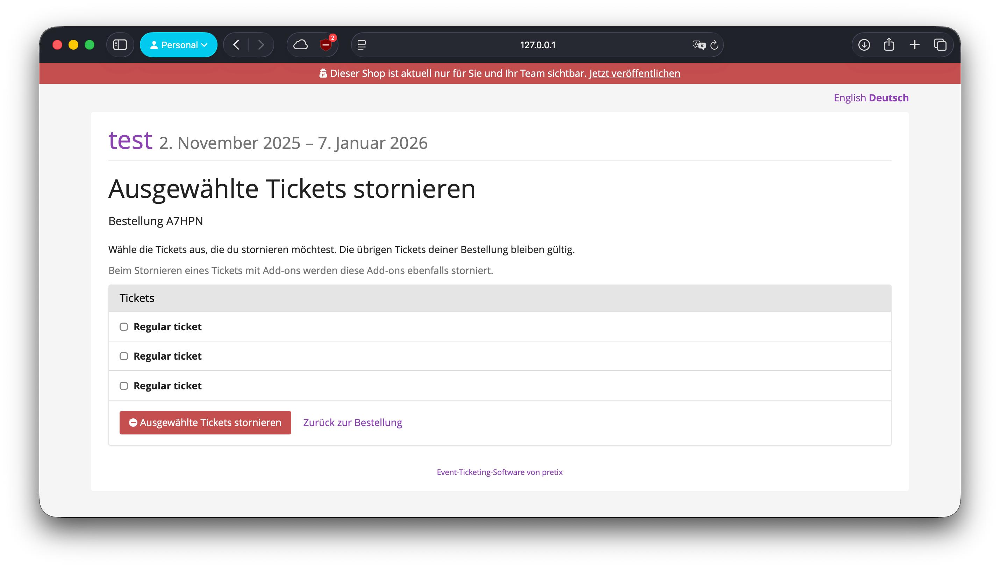

# Pretix Partial Cancellation Plugin

This plugin allows customers to partially cancel tickets in free orders from the order
confirmation page.

## Features

- Adds a "Cancel selected tickets" action on the order page.
- Lets the customer choose which positions to cancel.
- Keeps the remaining tickets valid.



## Requirements

- pretix 2025.7.0 or newer

## Installation

1. Install the plugin:

   ```bash
   pip install pretix-partial-cancellation
   ```

2. Restart your pretix instance.
3. Enable the plugin in your event.
4. Go to "Settings → Partial cancellation" and enable the feature.

## Notes

- Partial cancellation is only allowed for free orders and if the order contains more than one position.
- If a ticket has add-ons, canceling the ticket will also cancel those add-ons.
